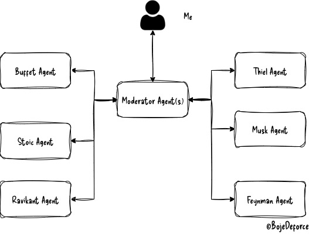

# Project overview

This project implements a multi-agent roundtable discussion system using AI agents. Each agent has a specific role, and they provide their view on a given query. The system includes a moderator agent that *facilitates* the discussion by calling on other agents to provide their insights.



# Key Components
- **Agents**: Role-specific AIs, configured via YAML (name, instructions, model).  
- **Moderator**: Orchestrates the discussion, invokes agents and gets results.  
- **Synthesizer**: Summarizes the discussion and provides a final output.
- **Main Script (`main.py`)**: Entry point; spins up agents and runs the discussion asynchronously.  
- **Agent Loader (`agentloader.py`)**: Contains `pydantic` `dataclass` to validate configs and contains function to load agent configs.  

# Usage
This project uses `uv` for dependency management.  
Dependencies are defined in `pyproject.toml` and locked in `uv.lock`.

To install and run:

```bash
uv sync
```
2. **Environment Setup**: Ensure you have the necessary environment variables set up using a `.env` file (e.g. `OPENAI_API_KEY`).
2. **Configuration**: Define your agents in the `configs/agents` directory using YAML files.
3. **Run the Script**: Execute the `main.py` script to start the roundtable discussion.

```bash
uv run python main.py
```

# Example

Here’s a simple example the agent in action:

```bash
User: 

What’s the one piece of advice you’d give to someone starting their career today?

... [the agents invdividually respond]...

Final response:

Synthesizing across the different perspectives:

Both Warren Buffett and Naval Ravikant emphasize the value of personal growth and continuous learning as the cornerstone for a successful career. Buffett stresses investing in yourself—your character, skills, and reputation—while Ravikant urges you to optimize for learning rather than status or short-term pay and to seek leverageable skills and environments.

Elon Musk and Richard Feynman share the view that genuine curiosity and the pursuit of important, challenging problems is vital. Musk recommends pursuing work that is both personally fascinating and impactful for the world, learning rapidly, embracing failure, and building strong teams. Feynman highlights the power of maintaining curiosity, fearlessly asking questions, and finding joy in deeply understanding things.

Peter Thiel and the Stoic philosophers (Marcus Aurelius, Seneca, Epictetus) both advocate for independent thinking, though from slightly different angles. Thiel encourages seeking out unique, contrarian insights rather than following the crowd, and building on those to create value. The Stoics urge you to focus on virtues like diligence, honesty, and resilience, accepting what you cannot control and grounding your career in character rather than status or external markers.

In summary: 
Across all views, the core is to invest in yourself—through continuous learning, curiosity, integrity, and independent thinking. Seek meaningful challenges, stay true to your values, and focus on building skills and relationships that compound over time. Pursuing what interests and energizes you, while being thoughtful about the impact you want to make, forms the strongest foundation for a rewarding career.

```


# Future ideas
- [ ] Support multi-turn conversations  
- [ ] Enable external tool use (e.g. search)  
- [ ] Open-source-only version (no OpenAI dependency)  